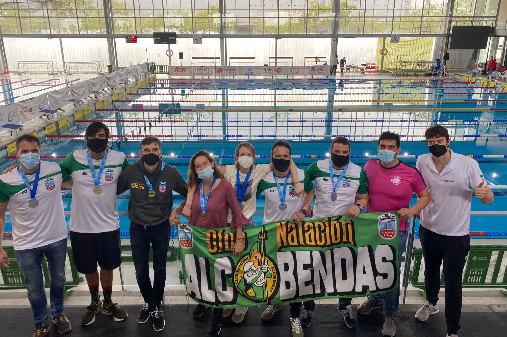

```{r setup, include=FALSE}
knitr::opts_chunk$set(
	message = FALSE,
	warning = FALSE,
	include = FALSE
)
library(tidyverse)
library(flextable)


```

 \#\# El cuatrocientos

Acabamos de llegar de nadar el [XXVI campeonato de España de natacion master de invierno](https://rfen.es/es/section/web-master-invierno-2021) en [Castellon](https://www.castellonturismo.com/) donde pasamos un día fantástico, ver a compañeros nadadores de otros equipos, concentrarnos para nadar, en fin, un dia de muchas emociones, aún lejos de lo que es "normal.

Aqui estamos todos interesados en saber como fué el **400... claramente la prueba reina del campeonato.**

### primero revisamos cuantos nadamos:

```{r echo=FALSE, message=FALSE, warning=FALSE}

cuatrocientos <- read_rds("../../clean_data/cuatrocientos.rds")

cuatrocientos %>% 
    mutate(genero = ifelse(genero == "F", "Mujeres", "Hombres")) %>% 
    count(genero) %>% 
    rename("cuantos nadamos?" = "genero") %>% 
    flextable() %>% autofit() %>% bold(bold = TRUE, part = "header")

```

## y las edades??

```{r fig.height=12, paged.print=FALSE}
cuatrocientos$año <- as.factor(cuatrocientos$año)
cuatrocientos$año <- fct_relevel(cuatrocientos$año, "01", after = Inf)
cuatrocientos$año <- fct_relevel(cuatrocientos$año, "00", after = Inf)
ggplot(cuatrocientos, aes(año))+
    geom_bar(alpha = 0.5)+
    geom_vline(xintercept = "72", color= "red", size = 2)+
    theme_minimal()+
    labs(x =" De que año somos?",
         y = "numero de competidores")+
    coord_flip()
```
